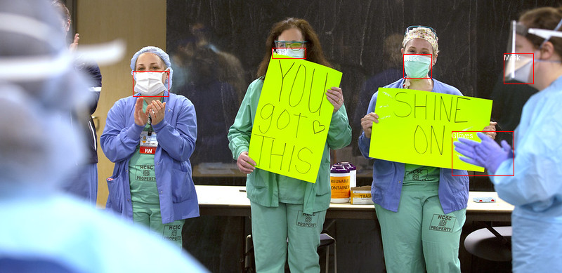

# HKU-DASC7606-A1: Object Detection with Advanced Models

**Course:** HKU DASC-7606 (2024-2025)
**Assignment:** 1 - Object Detection with Advanced Models

**Important:** This codebase is exclusively for HKU DASC 7606 (2024-2025). Please do not upload your solutions or this codebase to any public platforms. All rights reserved.

---

## 1. Introduction: Detecting Objects in Images

### 1.1. What is Object Detection?

Imagine you're building a system that can identify and localize objects in images or videos, such as cars, pedestrians, animals, or everyday objects. **Object Detection** is a critical task in computer vision that involves both classifying objects in an image and drawing bounding boxes around them.

**Why is Object Detection Important?**

Object detection is fundamental to numerous applications, including:

* **Autonomous Vehicles:** Identifying pedestrians, vehicles, and traffic signs.
* **Surveillance Systems:** Detecting intruders or monitoring activities in a scene.
* **Healthcare:** Locating tumors or anomalies in medical images.
* **Retail:** Enhancing inventory tracking by detecting objects on shelves.
* **AR/VR:** Understanding scenes to enable seamless virtual integration.

<div align="center">
  
</div>
<p align="center">
  Figure 1. An example of 2D Object Detection from the given dataset.
</p>

### 1.2. A New Era of Object Detection Models

Traditional object detection systems relied on techniques like sliding windows and region proposals, coupled with convolutional neural networks (CNNs). Recent advancements, including transformer-based models such as DETR (DEtection TRansformer), YOLO (You Only Look Once), and DINO (DETR with Improved Optimization), have revolutionized the field, offering simplicity, speed, and high performance.

**What Makes Modern Models Stand Out?**

* **[YOLO](https://docs.ultralytics.com/#yolo-a-brief-history):** An efficient single-stage model that predicts bounding boxes and class probabilities directly, excelling in real-time applications.
* **[DETR](https://arxiv.org/abs/2005.12872):** A transformer-based model that handles object detection as a set prediction problem, leveraging global context for accurate detection.
* **DINO [V1](https://arxiv.org/abs/2104.14294) [V2](https://arxiv.org/abs/2304.07193):** A refined version of DETR that improves training efficiency and scalability, making it suitable for large-scale and dense object detection tasks.
* **Flexibility:** Advanced models like Deformable DETR, YOLOS, and DINO provide enhancements for specific use cases, including dense and multi-scale object detection.
* **Speed and Simplicity:** YOLO models, such as YOLOv10 and YOLOv11, prioritize inference speed without compromising accuracy, making them ideal for resource-constrained applications.

### 1.3. Your Mission in This Assignment

In this assignment, you will explore object detection using state-of-the-art models. While transformer-based models like DETR and DINO are encouraged, you are free to use any model, including YOLO or other architectures, that meets the requirements of the `transformers.Trainer` [API](https://huggingface.co/docs/transformers/main_classes/trainer). You will:

* **Understand the Basics:** Learn how object detection models operate in the context of this assignment.
* **Get Hands-On:** Preprocess image data, including annotation handling and image augmentation.
* **Build and Train:** Fine-tune a model (e.g., DINO, DETR, YOLO, or others) on the basic CPPE-5 dataset.
* **Evaluate and Analyze:** Assess your model’s performance using standard metrics like **mAP (mean Average Precision)** and analyze its strengths and weaknesses.
* **Become an Object Detection Expert:** Gain a deeper understanding of the challenges in object detection and strategies for improvement.

---

## 2. Setting Up Your Object Detection Lab

### 2.1. HKU GPU Farm: Your High-Performance Playground (Recommended)

The HKU GPU Farm provides the computational power needed for training advanced object detection models. Follow the provided [quickstart guide](https://www.cs.hku.hk/gpu-farm/quickstart) to set up your environment.

### 2.2. Local Setup: For the Resourceful

If you have a powerful local machine with a suitable GPU and experience setting up deep learning environments, you can work locally. Ensure you have the necessary software (CUDA, cuDNN) installed and configured correctly.

### 2.3. Environment Setup: Your Toolkit

**Python:** This code is tested with Python 3.11.10.

**Virtual Environment (Recommended):** Use Anaconda to manage your project's dependencies and avoid conflicts:

```bash
conda create -n vision_env python=3.11.10
conda activate vision_env
```

**Install Packages:**

```bash
pip install -r requirements.txt
```

---

## 3. Embarking on Your Object Detection Journey

### 3.1. Dataset: CPPE-5 Dataset

You will work with the **CPPE-5 dataset**, which contains annotated images for personal protective equipment (PPE) detection tasks. This dataset provides bounding box annotations for various PPE elements such as coveralls, face shields, gloves, goggles, and masks. It is widely used in safety and compliance monitoring, enabling models to understand and detect PPE usage in various environments. **But for training, the dataset may not be strict to be CPPE-5. You can continue the pretrain process on other datasets.**

### 3.2. Preprocessing: Preparing Your Data for the Model

**Steps:**

1. **Load the Dataset:** Load the CPPE-5 dataset into a suitable data structure.
2. **Image Augmentation:** To prevent overfitting and improve model generalization, we will apply various augmentations to the training images. This includes geometric transformations (e.g., flipping, rotation) and color adjustments.
3. **Data Format and Annotation Handling:** Convert bounding box annotations to the format expected by the chosen model. For DETR series models, the annotations must be in the [COCO](https://cocodataset.org/#format-data) format, which DETR expects. Each image will have bounding boxes and associated class labels that need to be formatted accordingly.

---

### 3.3. Task Description: Your Object Detection Adventure

Your mission is divided into three key tasks:

#### Task 1: Preprocessing and Annotation Handling (dataset.py)

* **Objective:** Correctly load, preprocess, and augment the CPPE-5 dataset.
* **File:** `dataset.py`
* **Instructions:** Implement the sections marked with "`Write Your Code Here`".
* **Hints ([COCO](https://cocodataset.org/#format-data) format for example):**
  * Use the [Albumentations library](https://albumentations.readthedocs.io/en/latest/) to apply data augmentation to the images. These augmentations will help the model generalize better by applying random transformations while keeping the bounding boxes intact.
  For the training set, we'll apply several augmentations, while the validation set will remain unchanged [no-op].
  * The **annotations** in the dataset need to be reformatted into the COCO format that some models (e.g. DETR) expect. This involves converting the bounding boxes into the appropriate format and ensuring each annotation has the correct attributes like `image_id`, `category_id`, and `area`.
  * Combine the augmentations and annotation formatting into a function that applies these transformations to each image in the batch with `ImageProcessor`.

#### Task 2: Model Implementation (model.py)

* **Objective:** Define a model for object detection that meets the requirements of the `transformers.Trainer` [API](https://huggingface.co/docs/transformers/main_classes/trainer).
* **File:** `model.py`
* **Instructions:** Implement the sections marked with "`Write Your Code Here`".
* **Hints:**
  * Use any pre-trained model (e.g., DINO, YOLO, DETR) compatible with the `transformers.Trainer` API.
  * Adapt the model to the number of object categories in your dataset.
  * Ensure that the model's outputs include both bounding box coordinates and class probabilities.

#### Task 3: Trainer Argument Tuning (trainer.py)

* **Objective:** Tune the [training arguments](https://huggingface.co/docs/transformers/main_classes/trainer#transformers.TrainingArguments) to achieve better performance.
* **File:** `trainer.py`
* **Instructions:** Modify the `training_args` in the `trainer.py` file to optimize the training process.
* **Hints:**
  * Experiment with different values for `num_train_epochs`, `learning_rate`, `per_device_train_batch_size`, and other parameters.
  * Monitor the training and evaluation metrics to identify the best set of arguments.
  * Use tools like TensorBoard to visualize the training process and metrics (optional).
---

### 3.4. Submission: Packaging Your Object Detection Masterpiece

**If your student ID is 30300xxxxx, organize your submission as follows:**

```text
30300xxxxx.zip
|-- constants.py     # Constants and configurations
|-- dataset.py       # Data loading, preprocessing, and augmentation
|-- model.py         # Object detection model
|-- trainer.py       # Training loop and logic
|-- evaluate.py      # Evaluation metrics (mAP, precision, recall)
|-- requirements.txt # Python dependencies
|-- utils.py         # Utilization functions
|-- main.py          # Main script to run training and evaluation
```

---

### 3.5. Grading: Your Path to Recognition

We will run your `main.py` script to evaluate your model's performance. **\*Please add all additional libraries to `requirements.txt` file**

**Important Considerations:**

1. **Error-Free Execution:** Your code must run without errors.
2. **mAP Score**: To evaluate how your trained model performs.
3. **Training Time:** The training process should complete within **2 hours** with the HKU GPU Farm environment.

**Grading Breakdown (based on mAP score):**

| mAP Score | Training Time ≤ 2 Hours | Training Time > 2 Hours |
|-----------------|----------------------------|-------------------------|
| >45%       | 100% | 90%  |
| 37%-45%    | 90%  | 80%  |
| 34%-37%    | 80%  | 70%  |
| 30%-34%    | 70%  | 60%  |
| 22%-30%    | 60%  | 50%  |
| 10%-22%    | 50%  | 40%  |
| others     | 0%   | 0%   |

---

## 4. Extensions for the Ambitious (Optional)

* Experiment with different models (e.g., YOLOS, Deformable DETR, EfficientDet, DINO).
* Hyperparameter tuning using grid search or Bayesian optimization.
* Implement advanced augmentation techniques (e.g., MixUp, CutMix).
* Apply the pipeline to a different dataset (e.g., Pascal VOC).
* Explore integrating external knowledge for improved performance.
